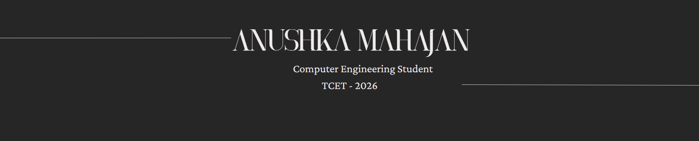

<!-- 🎨 Header Image -->
<p align="center">
  
</p>

<h1 align="center">Hey there! I'm <strong>Anushka Mahajan</strong> 🚀</h1>

<p align="center">
  Eat - Sleep - Study - Repeat
</p>

---

``` python
class Anushka:
    def __init__(self):
        self.role = "Learner"
        self.past_roles = ["Software Developer Intern @ Propero"]
        self.focus = ["DSA", "AI/ML", "Advanced Python"]
        self.hobbies = ["Coding", "Writing", "Solving Problems", "Being a Swiftie"]
        self.fun_fact = "I love Maths :) "
```

---

## 📡 Let's Connect

<p align="left">
  <a href="mailto:anushkambtech@gmail.com"></a>
  <a href="https://www.linkedin.com/in/anushka-mahajan09/"></a>
  <a href="https://twitter.com/AnushkaM_here"></a>
</p>

---


## 🔧 Tech I Can Talk About for Hours

| 🧩 Languages       | 🎨 Frontend              | 🧪 Data & Automation                                      | 🗄️ Databases         | 🖥️ More                  |
|-------------------|--------------------------|-----------------------------------------------------------|----------------------|--------------------------|
| Python, C++, Java | HTML, CSS, JavaScript    | Pandas, NumPy, scikit-learn, Selenium, Robocorp, RPA      | MySQL, PostgreSQL    | Blockchain, Cryptography |


---

## 🧪 Featured Experiments

### 🎯 [Recipe Finder](https://github.com/Anushkam09/Recipe-finder)
A minimalist static website built with HTML & CSS to help you find delicious recipes — served hot from the DOM 🍝

### 🤖 [Machine Learning Projects](https://github.com/Anushkam09/MachineLearning)
My ongoing playground for learning and building ML models — includes regression, classification, and notebook explorations 🧠

---
<p align="center">
  🎉 Thanks for visiting my space on the internet! Drop a star ⭐ if you like what you see.
</p>
